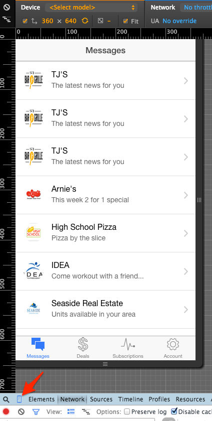

Channel-X Mobile
===============

Constant Contact Direct Marketing Mobile App

## Requirements

This project builds a mobile app using Cordove (PhoneGap), and the Ionic framework.
Use the following steps to install the required software:

```  
 $ brew update
 $ brew install node
 $ sudo npm install npm -g
 $ sudo npm install -g cordova
 $ sudo npm install -g ionic
 $ sudo npm install -g coffee-script
 $ sudo npm install -g http-server
```

## Build the Mobile App

```
  $ git clone <this repo>
  $ cd channelx_mobile
  $ ionic platform add ios
  $ ionic plugin add https://github.com/metova/coffee-script-cordova-plugin
  $ ionic build ios
```

## Running the Mobile App

#### Run in the Browser
```
  $ ionic serve
```




#### Run in the Simulator 
From the root of the project
```
  $ sudo npm install -g ios-sim
  $ ionic emulate ios
```

#### Run on Device
Note - You MUST have a Apple Developer account, and install the proper certificates and provisioning profile: https://developer.apple.com/membercenter/index.action 
```
  $ sudo npm install -g ios-deploy
  $ ionic run ios --device
```


